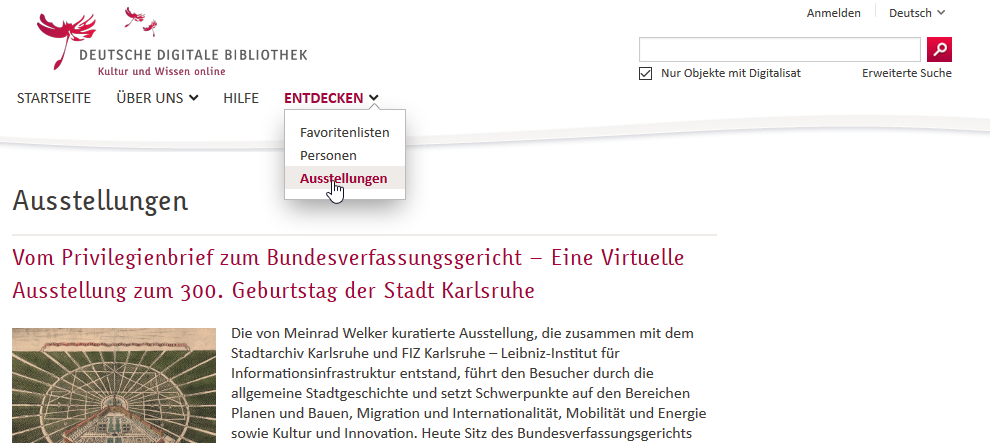

# Erläuterung der verwendeten Zeichen und Symbole

## Listen

### Unsortierte Listen
-   Rot
-   Grün
-   Blau

### Sortierte Listen
1.  Hund
2.  Katze
3.  Maus

### Umbrüche in Listen
*   Lorem ipsum dolor sit amet, consectetuer adipiscing elit.
    Aliquam hendrerit mi posuere lectus. Vestibulum enim wisi,
    viverra nec, fringilla in, laoreet vitae, risus.
*   Donec sit amet nisl. Aliquam semper ipsum sit amet velit.
    Suspendisse id sem consectetuer libero luctus adipiscing.

### Listenpunkte mit mehreren Absätzen
1.  Dies ist eine Listenpunkt mit zwei Absätzen. Lorem ipsum dolor
    sit amet, consectetuer adipiscing elit. Aliquam hendrerit
    mi posuere lectus.

    Vestibulum enim wisi, viverra nec, fringilla in, laoreet
    vitae, risus. Donec sit amet nisl. Aliquam semper ipsum
    sit amet velit.

2.  Suspendisse id sem consectetuer libero luctus adipiscing.

## Horizontale Linien
***

### Links

Ein Link zu [google](https://google.de) zum Bseipsiel.
Dies ist [ein Beispiel][1] für einen Referenz-Link.

## Betonung

*Einzelne Sternchen*

_Einzelne Unterstriche_

**Doppelte Sternchen**

__Doppelte Unterstriche__


## Tabellen

First Header | Second Header | Third Header
:----------- |:-------------:| -----------:
Left         | Center        | Right
Lorem ipsum dolor sit amet, consectetur adipisicing elit.         | Vero laboriosam quaerat maiores non, natus necessitatibus earum recusandae consectetur        | omnis pariatur architecto esse! Magni quibusdam nisi vero, in voluptas quia a!


## Code Blöcke

``` linenums="1"
Fenced code blocks are like Standard
Markdown’s regular code blocks, except that
they’re not indented and instead rely on
start and end fence lines to delimit the
code block.
```

``` php
<?php
define('MY_CONST', "My Constant");
$foo = new Bar();
if($foo->baz(MY_CONST) !== true) {
    // do something ...
}
?>
```

``` hl_lines="1 3" linenums="2"
"""Some file."""
import foo.bar
import boo.baz
import foo.bar.baz
```

InlineHilite adds support for inline code highlighting. It's useful for short snippets included within body copy, e.g. `#!js var test = 0;` und so weiter ...

## Grafiken

!![Alternativer Text][g1]

Stange that is
<sub><sup>*Abb1. Lorem ipsum dolor sit amet.*</sup></sub>
Isn't it?

!


## HTML Attribute

Hier steht was.
{: class="foo bar" title="Some title!" }

Und I love !!text-alert|custom span classes!! dont you think?

## Hinweise

!!! note "Eine Notiz"
    Lorem ipsum dolor sit amet, consectetur adipiscing elit. Nulla et euismod
    nulla. Curabitur feugiat, tortor non consequat finibus, justo purus auctor
    massa, nec semper lorem quam in massa.

!!! summary "Eine Zusammenfassung"
    Lorem ipsum dolor sit amet, consectetur adipiscing elit. Nulla et euismod
    nulla. Curabitur feugiat, tortor non consequat finibus, justo purus auctor
    massa, nec semper lorem quam in massa

!!! tip
    Lorem ipsum dolor sit amet, consectetur adipiscing elit. Nulla et euismod
    nulla. Curabitur feugiat, tortor non consequat finibus, justo purus auctor
    massa, nec semper lorem quam in massa.

!!! success
    Lorem ipsum dolor sit amet, consectetur adipiscing elit. Nulla et euismod
    nulla. Curabitur feugiat, tortor non consequat finibus, justo purus auctor
    massa, nec semper lorem quam in massa.

!!! warning "Eine Warnung"
    Lorem ipsum dolor sit amet, consectetur adipiscing elit. Nulla et euismod
    nulla. Curabitur feugiat, tortor non consequat finibus, justo purus auctor
    massa, nec semper lorem quam in massa.

!!! failure
    Lorem ipsum dolor sit amet, consectetur adipiscing elit. Nulla et euismod
    nulla. Curabitur feugiat, tortor non consequat finibus, justo purus auctor
    massa, nec semper lorem quam in massa.

!!! danger
    Lorem ipsum dolor sit amet, consectetur adipiscing elit. Nulla et euismod
    nulla. Curabitur feugiat, tortor non consequat finibus, justo purus auctor
    massa, nec semper lorem quam in massa.

!!! bug
    Lorem ipsum dolor sit amet, consectetur adipiscing elit. Nulla et euismod
    nulla. Curabitur feugiat, tortor non consequat finibus, justo purus auctor
    massa, nec semper lorem quam in massa.

## Fußnoten

Lorem ipsum[^1] dolor sit amet, consectetur adipiscing elit.[^2]

## Aufgabenlisten

- [X] item 1
    * [X] item A
    * [ ] item B
        more text
        + [x] item a
        + [ ] item b
        + [x] item c
    * [X] item C
- [ ] item 2
- [ ] item 3


## SmartSymbols

- (tm)
- (c)
- (r)
- c/o
- +/-
- -->
- <--
- <-->
- =/=
- 1/4, 2/32
- 1st 2nd 3te


## Marker

==mark me==


```
![alt text][logo]

[logo]: http://example.com/img/img.png "Logo Title Text 2"
```


Hier die Inhaltsübersicht:

[TOC]


[^1]: Lorem ipsum dolor sit amet, consectetur adipiscing elit.
[^2]:
    Lorem ipsum dolor sit amet, consectetur adipiscing elit. Nulla et euismod
    nulla. Curabitur feugiat, tortor non consequat finibus, justo purus auctor
    massa, nec semper lorem quam in massa.


[1]: https://google.de  "google Deutschland"


[g1]: img/image002.png  "Optionales title-Attribut"

