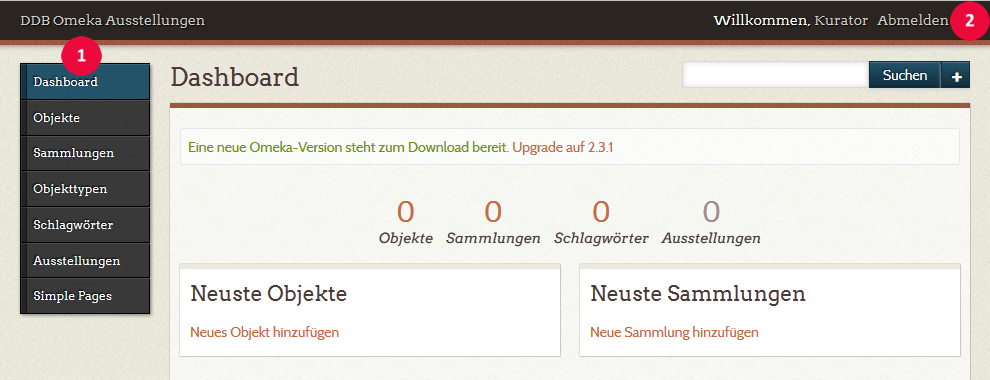
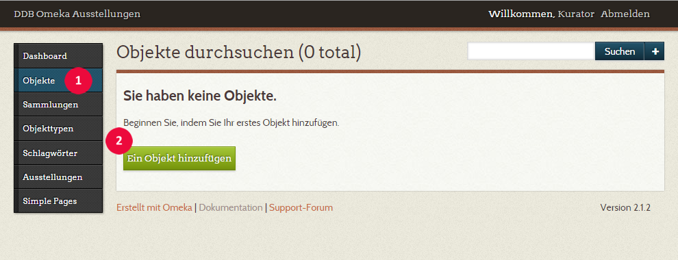
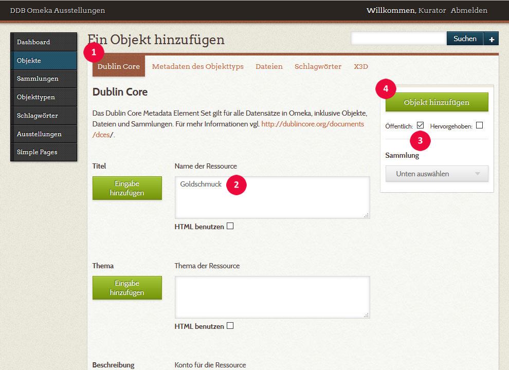
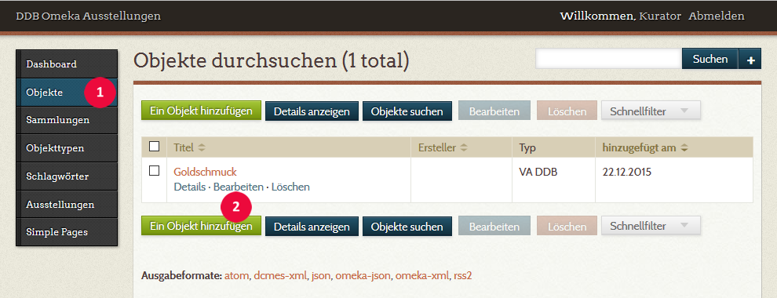
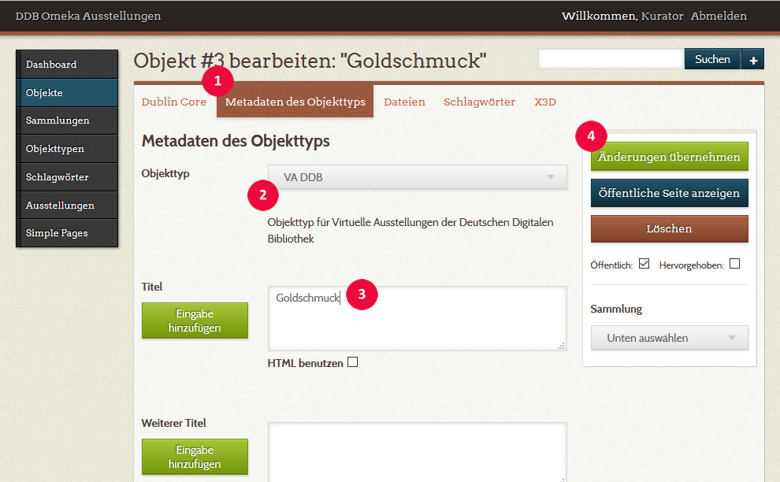
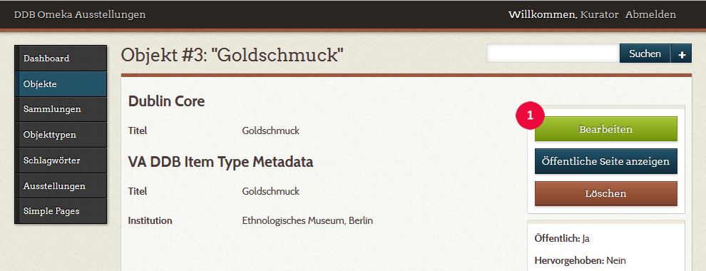
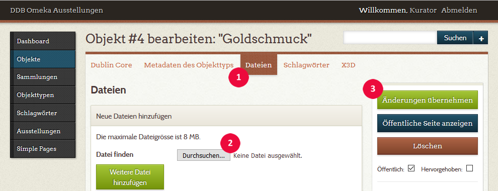
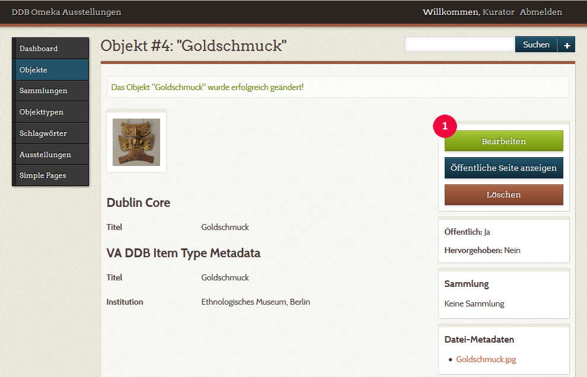
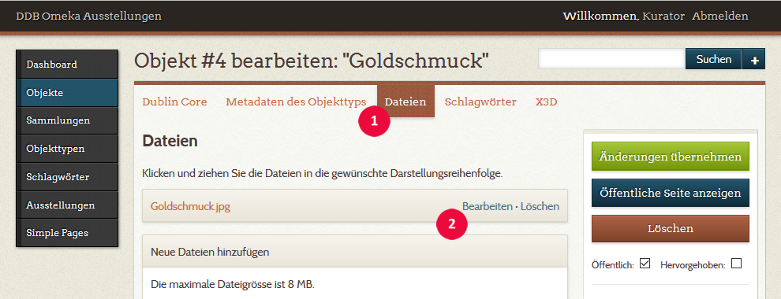

# Virtuelle Ausstellungen erstellen

## Das Omeka-Backend

Die Erstellung und Bearbeitung von virtuellen Ausstellungen erfolgt über die Redaktionsoberfläche von Omeka, das Omeka-Backend. Von Ihrem Ansprechpartner bei der Deutschen Digitalen Bibliothek haben sie die Zugangsdaten zu Ihrer Omeka-Installation erhalten. Nachdem Sie sich mit Ihrem Benutzernamen und Ihrem Passwort eingeloggt haben, gelangen Sie ins Omeka-Backend Abb. 1.1.
Das Menü links !!red-circle|1!! führt Sie zu den Rubriken, in denen Sie Ihre Ausstellung und bearbeiten können. Für Sie sind nur die Rubriken „Objekte“ und „Ausstellungen“ von Interesse. Der Startbildschirm „Dashboard“ bietet einen Überblick über die Anzahl der eingepflegten Objekte und Ausstellungen. Für jede virtuelle Ausstellung der DDB wird eigene Omeka-Installation verwendet. Sie arbeiten also immer nur mit einer Ausstellung.

!

Der Log-out erfolgt über den Textlink „Abmelden“ oben rechts !!red-circle|2!!.

## Objekte in Omeka

Die Grundbausteine einer Omeka-Ausstellung sind die Objekte, die ‚Exponate‘ der virtuellen Ausstellung. Aus Sicht der Nutzer, die Ihre Ausstellung im Internet besuchen, sind Objekte die Medien (Bilder, Videos, Audioclips, 3D-Objekte), die auf den Ausstellungsseiten präsentiert werden. Das Datenmodell von Omeka ist hier etwas differenzierter. Ein Omeka-Objekt ist nicht mit dem Digitalisat eines realen Objekts gleichzusetzen, es beschreibt vielmehr ein reales Objekt (z.B. ein Buch, ein archivalisches Dokument) durch Metadaten über dieses Objekt. Die Entsprechung zu einem Omeka-Objekt in einer vordigitalen Bibliothek wäre eine Karteikarte im Katalog – also nicht das Medium selbst. Mit einem Omeka-Objekt können in einem zweiten Schritt Dateien verknüpft werden, die dieses Objekt digital repräsentieren. Im klassischen Fall eines digitalisierten Realbestandes sind dies Scans oder Fotos, es kann sich aber auch um ein Video, eine Tonaufnahme oder ein 3D-Modell handeln. Omeka-Objekt und Digitalisat(e) sind also logisch getrennte Einheiten. Das gilt auch für nativ digitale Objekte wie etwa Videos oder Tonaufnahmen.

### Objekte hinzufügen

Um Objekte auf einer Ausstellungsseite einbinden zu können, müssen sie bereits angelegt worden sein. Dies geschieht in der Rubrik „Objekte“, wo auch alle Objekte einer Ausstellung zentral verwaltet werden (Abb. 2.1, 1).

!

Über die Schaltfläche „Ein Objekt hinzufügen“ (2) kann ein neues Objekt angelegt werden.
Die Seite „Ein Objekt hinzufügen“ (Abb. 2.2) bietet am oberen Rand eine Reihe von Tabs, über die sich die verschiedenen Eingabemasken aufrufen lassen, mit denen die Daten und Verknüpfungen zum betreffenden Objekt erfasst werden. Beim Aufruf der Seite vorausgewählt ist immer das Tab „Dublin Core“ (1).
Von dem umfangreichen Dublin-Core-Metadatenschema verwendet die DDB bei ihren virtuellen Ausstellungen nur das erste Feld „Name der Ressource“. Alle weiteren Metadaten werden in einem eigens für die virtuellen Ausstellungen der DDB angepassten Metadatenschema, dem Objekttyp VA DDB, erfasst. Für die interne Verwaltung der Objektdaten in Omeka, ist es erforderlich, diesem ersten Feld von Dublin Core einen Wert zuzuweisen (2): den Titel des Objekts.

!!! warning "Die Metadaten eines Objekts werden nicht in Dublin Core erfasst!"
    Wenn Sie ein Objekt hinzufügen oder bearbeiten gelangen Sie immer zuerst zum Tab „Dublin Core“.
    Die Metadaten zum Objekt erfassen sie aber nicht hier, sondern im folgenden Tab „Metadaten des Objekttyps“.
    Eingaben in „Dublin Core“ werden in der Frontend-Ausgabe nicht berücksichtigt.

!

Damit Objekte später in Ihrer virtuellen Ausstellung angezeigt werden können, müssen sie den Status „öffentlich“ haben (3). Ein Klick auf die Schaltfläche „Objekt hinzufügen“ (4) legt das neue Objekt in der Datenbank an.

!!! tip "PRAXISTIPP"
    Speicherstrategie – erst anlegen, dann ergänzen

Wie bei allen webbasierten Content- bzw. Asset-Management-Systemen arbeiten Sie bei Omeka in Ihrem Webbrowser (Client), die Daten werden aber auf dem Server gespeichert, auf dem Omeka installiert ist. Erst wenn Sie Ihre Eingaben dem Server übermitteln, in diesem Fall durch den Klick auf die Schaltfläche „Objekt hinzufügen“, sind Sie dauerhaft gespeichert. Die Tabs am oberen Rand ermöglichen Ihnen allerdings, zu weiteren Eingabemasken zu wechseln, ohne dass die Eingaben in der aktuellen Maske verloren gehen. Sie könnten also alle relevanten Formulare ausfüllen und erst am Ende das Objekt hinzufügen.

Wir empfehlen Ihnen, das Objekt schon anzulegen, nachdem Sie nur das Feld „Name der Ressource“ ausgefüllt haben. Die weiteren Daten können Sie dann im Modus „Objekt bearbeiten“ (siehe unten) einpflegen. So können Sie Ihre Eingaben zwischendurch immer wieder speichern und riskieren nicht, dass durch den Wechsel auf eine andere Seite, etwa durch einen unbedachten Klick auf einen Menüpunkt wie „Ausstellungen“ alle Eingaben verloren gehen.

!!! tip "PRAXISTIPP"
    Status „öffentlich“

In Omeka sind neu angelegte Objekte zunächst nicht öffentlich, wenn sie nicht explizit im Kästchen „Öffentlich“ einen Haken setzen. Für die Besucher Ihrer Ausstellung werden die Objekte nur angezeigt, wenn ihnen der Status öffentlich zugewiesen wurde. Solange Sie als Nutzer im Backend eingeloggt sind, sehen Sie auch im Frontend diese nichtöffentlichen Objekte. Das kann verwirrend sein und ist eine potenzielle Fehlerquelle. Wir empfehlen deshalb, gleich beim Anlegen eines Objekts die Einstellung „öffentlich“ vorzunehmen. Sie entwickeln Ihre Ausstellung ohnehin auf einem nichtöffentlichen Entwicklungsserver, die Veröffentlichung der Ausstellung, und damit auch der Objekte, erfolgt erst nach Fertigstellung durch Einbindung in das Portal der Deutschen Digitalen Bibliothek.

Objekte, die sie anlegen, am Ende aber doch nicht in Ihrer Ausstellung verwenden, sind für den Nutzer nicht direkt zugänglich, weil sie an keiner Stelle ausgegeben werden. Theoretisch besteht allerdings die Möglichkeit, sie über die Veränderung der URL im Browser des Nutzers aufzurufen, indem deren numerische Komponente verändert wird: z.B. …/show/110 zu .../show/111 oder auf gut Glück …/show/346 Um dies auszuschließen, sollten sie, bevor Ihre Ausstellung veröffentlich wird, nicht verwendete Objekte löschen oder nicht öffentlich (privat) setzen.

### Das Objekt mit Metadaten versehen

Zum Bearbeiten der Metadaten wählen Sie in der Rubrik „Objekte“ (Abb. 2.3, 1) das betreffende Objekt aus und klicken auf den Textlink „Bearbeiten“ (2).

Die virtuellen Ausstellungen der DDB arbeiten mit einem speziell zu diesem Zweck zusammengestellten Metadatenschema, das die notwendigen Angaben für unterschiedliche Objektkategorien wie Texte, Bilder, Filme, kunstgewerbliche Gegenstände etc. in einem Schema zusammenfasst, dem Objekttyp „VA DDB“. Die Werte mancher Felder werden bei der Ausgabe im Frontend direkt ausgeben, andere erzeugen nur einen Link oder dienen der Einbindung von Daten, etwa eines Vimeo-Videos. Nicht alle Felder müssen ausgefüllt werden; nicht ausgefüllte Felder werden bei der Ausgabe ignoriert.

!

Wechseln Sie auf der Seite „Objekt … bearbeiten“ (Abb. 2.4) auf den Tab „Metadaten des Objekttyps“ (1). In der Auswahlliste „Objekttyp“ wählen Sie den einzigen Eintrag „VA DDB“ aus (2) und füllen die Eingabefelder mit den Metadaten des Objekts. Hinweise zu den einzelnen Feldern finden Sie, wie erwähnt, im Anhang (XXX). Sichern Sie anschließend Ihre Eingabe mit einem Klick auf das Bedienfeld „Änderungen übernehmen“. Nachdem Sie das Formular ausgefüllt haben, ist eine gute Gelegenheit, Ihre Eingaben mit „Änderungen übernehmen“ (4) erst einmal zu sichern.

!

Leider gibt es in Omeka keine Möglichkeit, bei der Bearbeitung der Metadaten die schon vorgenommenen Eingaben zu speichern, ohne die Seite „Objekt … bearbeiten“ zu verlassen und auf die Seite „Objekt …“ zu gelangen (Abb. 2.5).

!

Um die Bearbeitung fortsetzen zu können, rufen Sie über die Schaltfläche „Bearbeiten“ (1) wieder die Seite „Objekt … bearbeiten“ auf und wählen dort den Tab „Metadaten des Objekttyps“ (vgl. Abb. 2.4). Das ist sicherlich etwas umständlich, die zwei Klicks sind aber gut investiert, und wir empfehlen dringend, bei komplexen Eingaben gelegentlich zwischenzuspeichern.

!!! warning "Speichern Sie vor dem Wechsel der Rubrik!"
    Wenn Sie die Seite verlassen, auf der Sie gerade ein Objekt bearbeiten, ohne zuvor die Eingaben mit „Änderungen übernehmen“ auf dem Entwicklungsserver gespeichert zu haben, sind Ihre Eingaben verloren. Zu einem Wechsel der Seite kommt es z.B., wenn Sie in der linken Navigation auf „Dashboard“, „Ausstellungen“ oder „Objekte“ klicken. Leider fragt Omeka nicht per Prompt nach, ob Sie diese Seite wirklich verlassen möchten. Gegen ärgerliche Datenverluste und doppelte Arbeit, hilft häufiges Zwischenspeichern! Möchten Sie während der Dateneingabe andere Seiten konsultieren, z.B. in den Metadaten eines anderen Objekts nachschauen, öffnen Sie diese neuen Seiten am besten in einem neuen Browser-Tab.

### Das Objekt mit Dateien verknüpfen

#### Verknüpfung mit einer Bild- oder Audiodatei

Sie können nun eine Datei mit dem Objekt verknüpfen. Wenn es sich um eine Bilddatei handelt, wird sie im Frontend als Vorschaubild und in der Lightbox im Großformat angezeigt. Verknüpfen Sie eine Audiodatei mit dem Objekt, erscheint auf der Ausstellungsseite ein entsprechendes Symbol, über das ein Audioplayer geöffnet wird, mit dem die Nutzer den Audioclip anhören können.
Angaben zu verwendbaren Bild- und Audio-Dateiformaten finden Sie im Anhang (XXX).
Zum Verknüpfen mit einer Datei wechseln Sie auf der Seite „Objekt … bearbeiten“ (Abb. 2.6) auf den Tab „Dateien“ (1) und wählen über die Schaltfläche „Durchsuchen“ (2) eine Datei auf Ihrem lokalen Datenträger aus.

!

Nachdem Sie die Änderungen übernommen haben (3), wird die verknüpfte Datei auf der Objektseite (Abb. 2.7) als Vorschaubild angezeigt. Wenn Sie nun wieder in den Modus „Bearbeiten“ wechseln (1), und dort zum Tab „Dateien“ wechseln (Abb. 2.8), erscheint der Name der verknüpften Datei in einem Drag-and-Drop-Balken mit Textlinks zum Bearbeiten und Löschen der Datei.

!!! warning "Datei löschen ist nicht gleich Objekt löschen!"
    Wenn Sie eine verknüpfte **Datei** löschen möchten, klicken sie auf den Textlink „Löschen“
    (neben „Bearbeiten“) **nicht** auf die Schaltfläche „Löschen“ im Kasten rechts –
    diese löscht das ganze **Objekt**, nicht nur die Datei.

!

!

Über den Textlink „Bearbeiten“ (2) haben Sie die Möglichkeit, die Datei mit Metadaten zu versehen, wobei als Metadatenschema Dublin Core fest vorgegeben ist (Abb. 2.9). Diese Metadaten werden in der Ausgabe nicht berücksichtigt, Sie können sie aber für interne Zwecke nutzen

